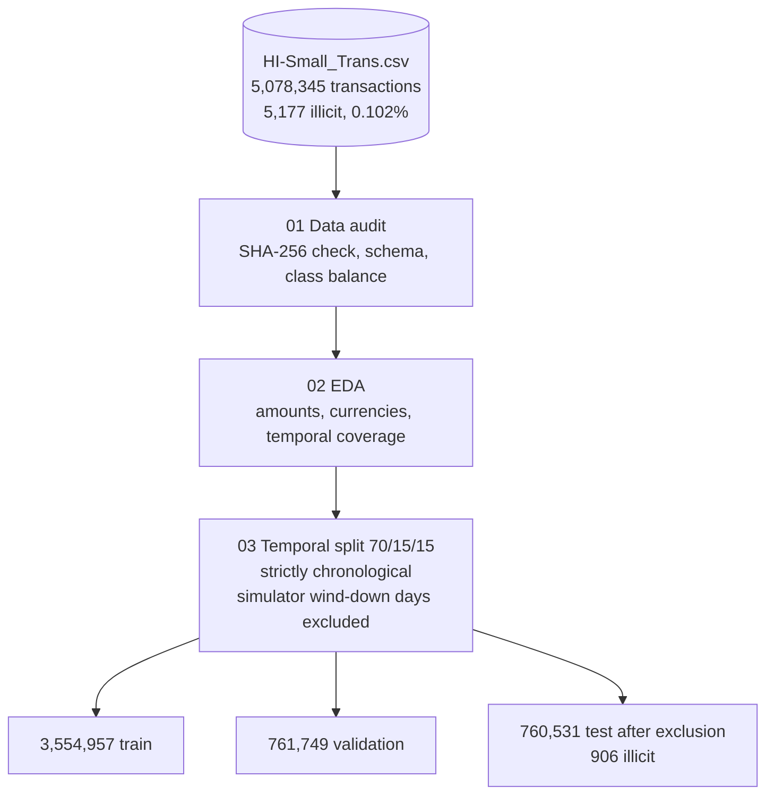
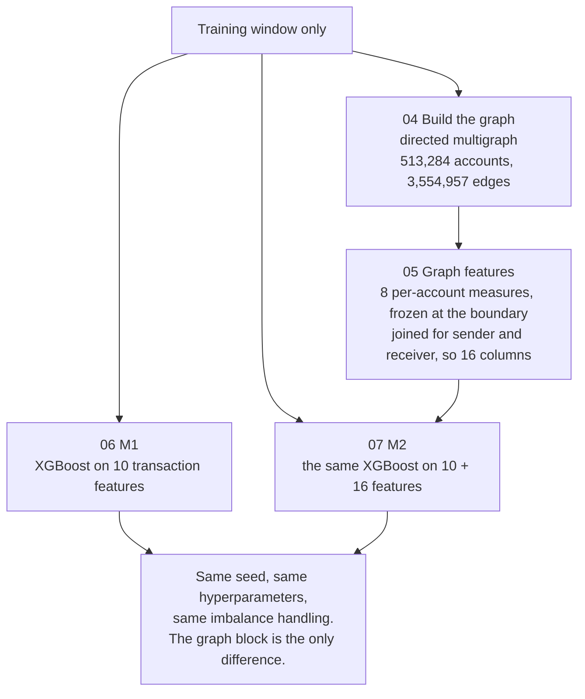
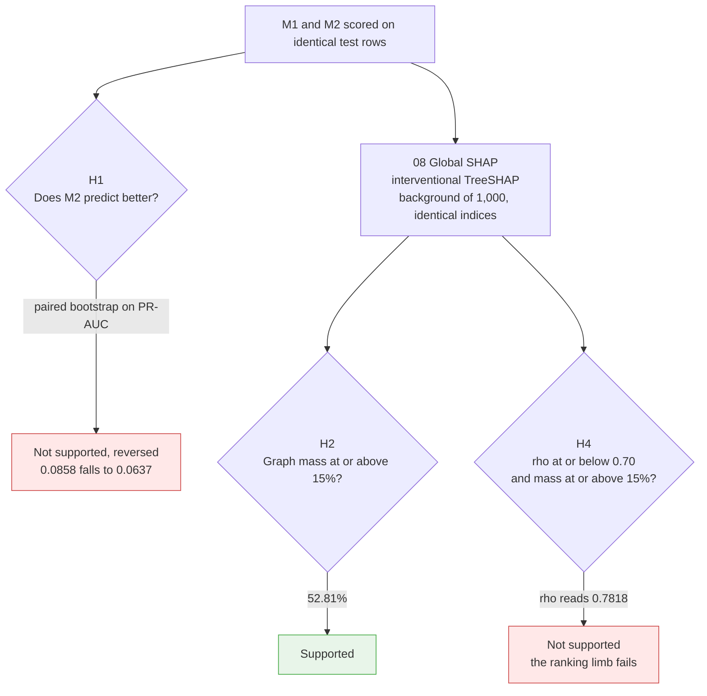
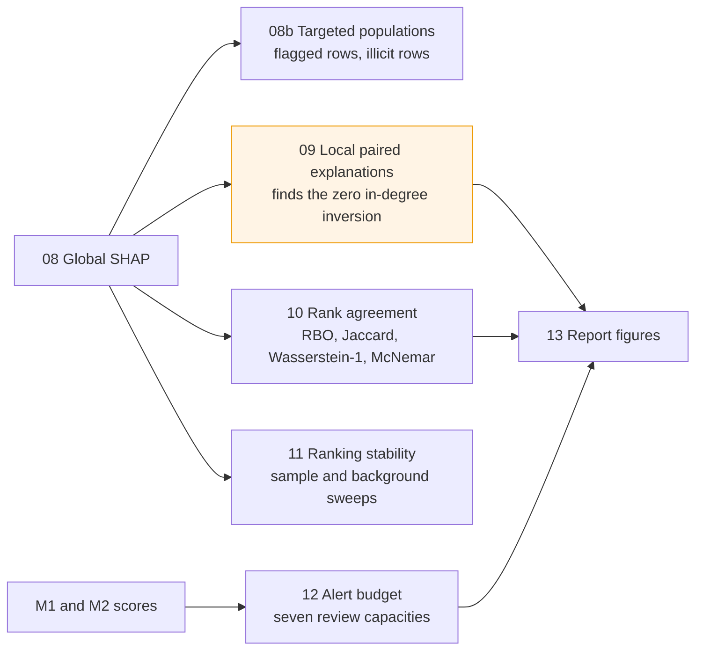

# Graph-Aware Explainable AI for AML Detection

**A cross-architecture SHAP comparison on the IBM AMLworld benchmark**

MSc Financial Technology dissertation project, UMADXD-60-M, University of the West of England, Bristol.
Pre-registration: [osf.io/37qjk](https://osf.io/37qjk), registered before any model was fitted.

---

## What this project asks

Banks are adding network-derived features to their transaction-monitoring models, and they explain those models with SHAP. This project asks the question sitting underneath both practices. When you add graph features to a detector, does the explanation change, and would an auditor notice?

To answer it, two models are trained that differ in exactly one way.

* **M1** is XGBoost on ten transaction-level features only.
* **M2** is the same XGBoost, same seed, same hyperparameters, same imbalance handling, plus sixteen graph features.

Because the graph block is the only thing that varies, every number here is a statement about *that difference*, not about either model on its own. That distinction matters, because in absolute terms both models are weak detectors on this benchmark. Neither is deployable. The comparison is still valid.

## What it found

Three results, and two of them contradict what was registered.

**Graph features made detection worse.** PR-AUC fell from 0.0858 to 0.0637, a paired bootstrap difference of -0.0221 with a 95% interval entirely below zero. M2 also caught fewer illicit transactions at every review capacity tested. H1 was registered as "M2 predicts better". It reversed.

**But they dominated the explanation.** Graph features carried 52.81% of M2's attribution mass and took seven of the top ten positions. So a feature family that makes the model worse looks, in a SHAP plot, like the thing the model most depends on. Explanatory prominence is not predictive contribution.

**And whether you can see the shift depends on which statistic you compute.** Spearman rho across the features shared by both models reads 0.7818, which says high agreement and nothing to see. Rank-biased overlap across the full feature lists reads 0.5245. Same two models, same explanations, two very different answers. The firm effectively chooses what its supervisor gets told.

Underneath that sits the finding worth reading first. M2 learned that an account with **no prior sending history is less suspicious**. In the 1.77% of evaluation rows where the receiving account has zero distinct other senders, rows carrying 17.7 times the illicit rate of everything else, recall collapses from 34.7% to 0.46%. Outside that stratum the two models tie exactly. A validator looking at one global importance plot and one aggregate recall number would have approved a model that misses 218 of 219 laundering transactions in a segment identifiable from the feature list alone.

Full interpretation and the compliance recommendations are in the written report. This repository is the evidence behind it.

---

## If you only want to check the work

You do not need to run anything. Every notebook is committed **with its output cells intact**, so the results are readable straight from GitHub. If you want to be sceptical efficiently, this is the order I would suggest.

1. **`notebooks/03_split.ipynb`** for the temporal split. This is where leakage would enter if it entered anywhere, so it is the right place to start.
2. **`notebooks/07_M2_graph.ipynb`** for H1, the paired bootstrap and the pre-registered staleness strata. This contains the result that reversed.
3. **The global SHAP notebook (08)** for H2 and H4, the two hypotheses the novelty claim rests on.
4. **The local paired notebook (09)** for the zero in-degree segment, which is the single most important finding in the project.
5. **`outputs/tables/`** for every reported number, persisted as CSV or JSON. Nothing in the report is typed by hand. Each figure traces back to a file here.

Commit timestamps establish the order things were run in. In particular, the post-hoc analyses sit above the commits containing the registered verdicts, not before them.

---

## How the pipeline fits together

Four stages, four small diagrams. Each one feeds the next.

### Stage 1. Get the data honest before touching a model

Nothing downstream is worth anything if the split leaks, so the first three notebooks do no modelling at all. They verify the file is the file, look at what is actually in it, and cut it strictly by time.



The split is chronological rather than random, so no future information can reach a training row. The simulator winds down at the end of its run and produces an unrepresentative tail, so those days are dropped, and the cost of dropping them is measured rather than assumed.

### Stage 2. Build two models that differ in one thing only

The graph is built from training-window edges only, and account profiles are frozen at the training boundary. Accounts appearing later get the training median for continuous features and zero for counts, which removes signal from M2 and never adds any. That is deliberate. It makes any measured advantage a lower bound rather than an inflated one.



This is the whole design in one picture. Change two things at once and you cannot attribute the result to either, so nothing else moves.

### Stage 3. Test the registered hypotheses

Both models are scored on identical test rows, with identical indices passed to SHAP, so the comparison is genuinely paired rather than two separate analyses placed side by side.



Two of these failed. They are reported exactly as they came out, against thresholds fixed in advance, with no retuning. A registered hypothesis that fails is a result, not a problem to be engineered away.

### Stage 4. Work out what the failures actually mean

The registered verdicts are only the start. These notebooks ask where the difference lives, whether it survives perturbation, and whether it would be visible to someone auditing the model.



Notebook 09 is highlighted because it is where the project stops being about statistics and becomes about a bank. It is the notebook that found a model treating an absent sending history as a reason for confidence.

---

## Reproducing this

### What you need

* Windows, macOS or Linux. This was developed on Windows 11 in VS Code with the Jupyter extension, so the commands below are PowerShell, but they translate directly.
* Miniconda or Anaconda.
* Around 16 GB of RAM. The whole pipeline runs on a laptop CPU. No GPU is needed, since the optional GNN arm was cut from the final study.
* A Kaggle account, to download the dataset.

### 1. Clone and build the environment

```powershell
git clone https://github.com/Charan2606Rajashekar/graph_AML_pipeline.git
cd graph_AML_pipeline

conda env create -f environment.yml
conda activate graphaml
```

That creates an environment called `graphaml` with the exact stack these results were produced on: Python 3.11, xgboost 2.1.4, python-igraph 0.11.x, shap 0.46.x, scikit-learn 1.5.x, pandas 2.2.x, pyarrow 15.x. The pins are deliberate. SHAP's behaviour is version-sensitive, so a newer release may not reproduce these numbers exactly.

If conda gives you trouble, `requirements-lock.txt` is a pip fallback.

```powershell
python -m venv .venv
.\.venv\Scripts\Activate.ps1
pip install -r requirements-lock.txt
```

### 2. Get the data

The dataset is not in this repository. It is five million rows, and its licence asks that you get it from the source rather than a copy.

1. Go to [IBM Transactions for Anti Money Laundering (AML)](https://www.kaggle.com/datasets/ealtman2019/ibm-transactions-for-anti-money-laundering-aml) on Kaggle.
2. Accept the Community Data License Agreement Sharing 1.0. You have to do this yourself.
3. Download `HI-Small_Trans.csv` and put it at `data/raw/HI-Small_Trans.csv`.

Then confirm you have the same file.

```powershell
Get-FileHash data\raw\HI-Small_Trans.csv -Algorithm SHA256
```

It should match the `sha256` recorded in `manifest.json`. If it does not, stop there, because every number downstream assumes that exact file. Notebook 01 re-checks this automatically and fails loudly rather than carrying on.

### 3. Run the notebooks in order

Open the repo in VS Code, select the **`graphaml`** kernel, and run the notebooks by number. They are sequential. Each one reads what the previous one wrote into `outputs/`.

| # | Notebook | What it does | Roughly |
|---|---|---|---|
| 01 | `01_data_audit.ipynb` | Hash check, schema, class balance, licence record | 2 min |
| 02 | `02_eda.ipynb` | Amounts, currencies, temporal coverage | 5 min |
| 03 | `03_split.ipynb` | Temporal 70/15/15, wind-down exclusion, leakage unit test | 5 min |
| 04 | `04_graph_build_train.ipynb` | Directed multigraph from train-window edges only | 15 min |
| 05 | `05_graph_features.ipynb` | Eight per-account measures, joined for sender and receiver | 20 min |
| 06 | `06_M1_Baseline.ipynb` | M1, transaction features only | 10 min |
| 07 | `07_M2_graph.ipynb` | M2, paired bootstrap (**H1**), staleness strata, McNemar | 25 min |
| 08 | global SHAP | Interventional TreeSHAP (**H2**, **H4**) | 30 min |
| 08b | targeted populations | Attribution mass on flagged and illicit rows | 10 min |
| 09 | local paired explanations | Case ladder, waterfalls, in-degree bands | 15 min |
| 10 | rank agreement | RBO, Jaccard at k, Wasserstein-1, paired tests | 5 min |
| 11 | ranking stability | Sample-size and background-size sweeps | 11 min |
| 12 | alert budget | Threshold-free recall at seven capacities | 5 min |
| 13 | report figures | The three figures used in the report | 5 min |

Times are from a mid-range laptop CPU. Notebooks 04 and 05 are the slow ones. Everything after 05 is fast, because it reads cached Parquet.

`verification.ipynb` re-checks the headline numbers against the persisted artefacts. Run it last if you want a single pass or fail.

### 4. Check you got what I got

Seed 42 is set globally, so a correct run should reproduce these to the digit. If yours differ, something diverged upstream. Check the SHA-256 first, then the split boundaries.

| Quantity | Expected |
|---|---|
| Train, validation, test rows | 3,554,957 / 761,749 / 761,639 |
| Test rows after wind-down exclusion | 760,531, containing 906 illicit |
| Graph vertices and edges | 513,284 / 3,554,957 |
| M1 PR-AUC | 0.0858 |
| M2 PR-AUC | 0.0637 |
| Paired difference, 95% CI | -0.0221, from -0.0395 to -0.0064 |
| Graph-feature SHAP mass in M2 | 52.81% |
| Spearman rho, shared features | 0.7818 |
| RBO, full lists then shared only | 0.5245 / 0.8054 |
| Zero in-degree recall, M1 then M2 | 76 of 219 / 1 of 219 |

---

## What is in here

```
graph_AML_pipeline/
├── notebooks/          # 01 to 13, committed with output cells intact
├── outputs/
│   ├── tables/         # every reported number, as CSV or JSON
│   ├── figures/        # SHAP plots, waterfalls, report figures
│   └── shap/           # persisted SHAP value arrays and metadata
├── data/
│   └── raw/            # you put HI-Small_Trans.csv here (gitignored)
├── environment.yml     # conda environment, the authoritative one
├── requirements-lock.txt
├── manifest.json       # dataset SHA-256, row counts, licence, source
└── README.md
```

Model artefacts (`m1_baseline.json`, `m2_graph_xgb.json`) and scored probabilities (`*_test_probs.parquet`) are in `outputs/`, so the trained models can be inspected without retraining them.

---

## Honest notes

Things a careful reader should know up front rather than discover later.

**Both models are weak.** M1's top-100 precision is 0.37. This is a controlled contrast, not a detection system, and no claim here depends on either model being good.

**Class weighting is deliberately untuned.** `scale_pos_weight` follows the registered rule N_neg over N_pos, giving 1,244, far outside the range of 1 to 10 that Altman et al. tuned over. That costs precision. It is the price of applying identical treatment to both models so the comparison stays fair, and it is declared in the report rather than buried.

**Four of the eight graph measures are currency-confounded by construction.** The amount-weighted ones, meaning in-flow, out-flow, net flow and weighted PageRank, mix magnitude with currency because no FX conversion is applied, which matches the field standard for this benchmark. This is declared rather than demonstrated, and the displacement result deliberately turns on the ten shared features, which sit outside that cluster.

**Single seed.** Everything rests on seed 42 with no seed-sensitivity sweep. A reproduction on other seeds would be a genuine contribution.

**`03_split.ipynb` carries a hard-coded absolute path** from an earlier machine. If you are running from a clean clone, set the data path at the top of that notebook before executing it.

**The GNN arm was cut.** H3 was registered and is reported as not tested. Changing the architecture and the feature set at the same time would have confounded the contrast H4 depends on, so dropping it was the lesser evil.

---

## Pre-registration and integrity

The design, the four hypotheses and every threshold were registered at [osf.io/37qjk](https://osf.io/37qjk) before any model was fitted. Two of the primary hypotheses failed. They are reported unchanged, against thresholds set in ignorance of the outcome, and nothing was retuned to rescue them.

Three deviations from the registration are declared in the report. The single-case selection ladder was replaced by a four-category form. Rank-biased overlap restricted to shared features is post hoc, since the registered measure runs on full lists. The in-degree segmentation and four of the seven alert budgets are likewise post hoc. Commit history supports the ordering, because the post-hoc notebooks sit above the commits carrying the registered verdicts.

---

## Licence and citation

The **data** is IBM's AMLworld HI-Small, licensed CDLA-Sharing-1.0 (Altman et al., 2023). It is not redistributed here. Get it from Kaggle and accept the licence yourself.

The **code** in this repository is released under the MIT Licence. See `LICENSE`.

If you use this work:

> Rajashekar, C. (2026) *Graph-Aware Explainable AI for AML Detection: A Cross-Architecture SHAP Comparison*. MSc Financial Technology dissertation, University of the West of England, Bristol. Pre-registration: osf.io/37qjk

Primary source for the dataset:

> Altman, E., Blanuša, J., von Niederhäusern, L., Egressy, B., Anghel, A. and Atasu, K. (2023) 'Realistic synthetic financial transactions for anti-money laundering models', *Advances in Neural Information Processing Systems 36*, Datasets and Benchmarks Track.

---

## Questions

Open an issue, or get in touch. If something does not reproduce, please tell me. A failed reproduction is more useful to me than a silent one.
